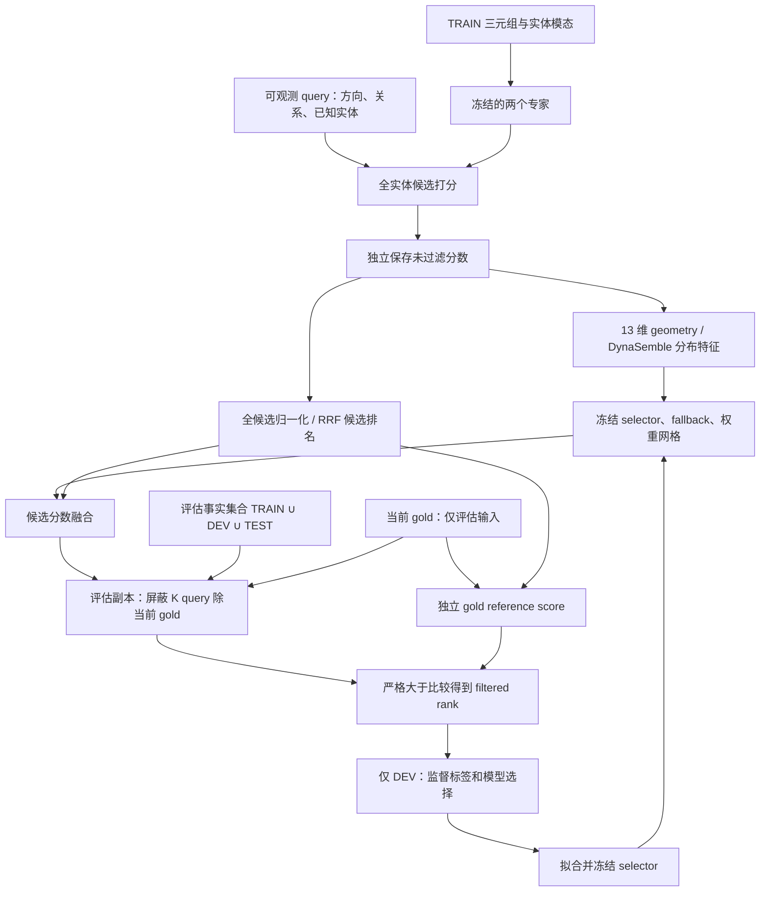

# Paper A：B07 / C04 特征与 filtered 答案边界核验

> 历史首次审计记录。后续六组主重评及四组 DynaSemble 重训练已取得并核验；当前结论和数值见 [修复后重评报告](G:/mmkg-project-research/docs/reports/paper_a_information_boundary_rerun_review_2026-09-10.md)。下文“待重跑”描述保留首次审计时点，不代表当前进度。

日期：2026-09-10。**结论：确认存在 gold 相关信息进入特征，不能仅修改措辞关闭。代码修复与单测已完成；全量重导出、重拟合、重评尚未完成，投稿仍阻断。**

| 风险 | 本次结论 | 关闭状态 |
|---|---|---|
| B07 | 原主导出将保留当前 gold 的 filtered 矩阵输入 13 维 geometry；z-score 也在过滤后计算 | P0 未关闭，待新结果 |
| C04 | 查清默认事实集合、gold 保留、头预测与重复规则；补充训练/推理/评估三条边界及单测 | 代码与说明已补齐；旧 DynaSemble 负采样还需重新训练 selector，因此整体未关闭 |

## 1. 原路径与因果反例

[score_expert_block](G:/mmkg-project-research/scripts/eval_heterogeneous_complementarity.py) 对每个候选 chunk 调用 scorer，随后 `filter_scores_` 将已知答案中**不等于当前 target**的实体设为 `-inf`，第一个返回值因此已经 filtered。原 `evaluate_unit` 将第一个返回值命名为 `raw_a/raw_b`，直接送入 `query_geometry_rows` 与 `query_zscore_with_reference`。`retain_unfiltered` 原来只随 X4 特征开关开启，并没有保护主方法的 geometry。

[query_geometry_tensor](G:/mmkg-project-research/router/query_geometry.py) 虽然不接收 target 参数，但输入矩阵已经携带 target 信息；“函数签名没有 gold”不能证明信息边界安全。旧注释称 filtered mask 只取决于 observed query，这一论断错误，已纠正。

例如同一 tail query `(0,0,?)` 的候选分数 `[1,12,5,4,2,0]`，已知答案为 `{1,2}`：

- 指定 gold=1：保留 12、屏蔽 5，top-1=12。
- 指定 gold=2：屏蔽 12、保留 5，top-1=5。

同一可观测 query 的特征直接随指定 gold 变化。这一反例通过真实 scorer/chunk/mask/export 路径运行，并覆盖 head 与 tail。修复后两种 gold 的完整未过滤分数、特征和权重一致。

## 2. 历史结果中的实际影响

[审计脚本](G:/mmkg-project-research/scripts/audit_paper_a_information_boundary.py) 只读扫描了 14 份旧导出；[audit.json](G:/mmkg-project-research/outputs/paper_a_safe_correction/information_boundary/audit.json) 记录每份文件的 SHA-256、分组数量和具体反例。分组键是 `(seed, direction, relation, observed entity)`，不包含 gold；只统计有两个以上不同 gold 的组。

| 主组合 TEST | 多 gold 可观测 query 组 | 特征不一致组 | ADC 连续权重不一致组 | ADC 最终网格权重不一致组 |
|---|---:|---:|---:|---:|
| MKG-W / M-Hyper + NativE | 2382 | 2382 | 2359 | 693 |
| MKG-W / M-Hyper + AdaMF-MAT | 2382 | 2382 | 998 | 225 |
| DB15K / M-Hyper + NativE | 5472 | 5472 | 4243 | 1601 |
| DB15K / M-Hyper + AdaMF-MAT | 5472 | 5472 | 512 | 194 |

这些是旧资产内的观测差异，不是修复后的性能差值，也不能将每一个浮点差异都归因于 mask。因果判断来自上面的受控代码路径反例。旧结果已经不满足用户提出的权重不变性最低条件。

## 3. 修复后的信息流



图中的 DEV 拟合与推理属于不同阶段；TEST 的 rank 没有回流到 selector。gold reference 的归一化仅使用候选向量已经确定的参数；gold 不反向影响这些参数。实现为了复用 endpoint，会先生成 filtered 评估副本；逻辑边界依靠独立存储而非仅靠调用时间。特征只读取未过滤副本。

```python
# Deployable inference: no y, no F
def infer(q, expert_a, expert_b, frozen_policy):
    ua = score_all_entities(expert_a, q)  # replaces the missing entity
    ub = score_all_entities(expert_b, q)
    phi = geometry(ua, ub, q.direction)
    alpha = frozen_policy(phi)
    za, stats_a = normalize_full_distribution(ua)
    zb, stats_b = normalize_full_distribution(ub)
    scores = endpoint_safe_combine(ua, ub, za, zb, alpha)
    return scores, alpha, stats_a, stats_b

# Evaluation only
def evaluate(q, y, F, inference_output):
    scores = inference_output.scores.copy()
    K = {e: fact(q, e) in F}
    scores[K - {y}] = -inf             # ALWAYS retain designated gold
    reference = transform_gold_reference_using_fixed_candidate_statistics(...)
    return 1 + count(scores > reference)

# DEV supervision only (within each training fold)
labels = rr_a_dev > rr_b_dev           # ties excluded from logistic fit
fit_preprocessing_and_selector(phi_dev_train, labels_dev_train)
# Held-out DEV / TEST reuse frozen preprocessing and policy.
```

## 4. C04：各阶段事实与监督边界

| 阶段 | 正样本/监督 | filter 事实集合 | 是否可进入推理特征 |
|---|---|---|---|
| 冻结专家训练 | TRAIN；M-Hyper reciprocal 扩展也源自 TRAIN | 有负采样的 trainer 使用 TRAIN-only truth index | 否 |
| 专家 DEV checkpoint evaluation | DEV 排名用于已有选择协议 | 默认 TRAIN ∪ DEV ∪ TEST | 否 |
| 主导出 DEV / TEST filtered evaluation | 当前 split 的指定 gold 只用于 reference/rank | 默认 TRAIN ∪ DEV ∪ TEST | 否 |
| 显式 `--dev-only-no-test-access` 导出 | DEV | TRAIN ∪ DEV，loader 不打开 TEST 行 | 否；这是单独的导出模式 |
| ADC / Query-soft 拟合 | DEV 的 filtered RR 偏好标签；每个训练 fold 独立拟合 preprocessing | 不向特征传递 filter；标签采用声明的 DEV 评估口径 | 否 |
| DynaSemble selector 训练 | DEV gold + sampled negatives，属于监督训练 | **修复后 TRAIN ∪ DEV**；旧版复用了全 split index，TEST facts 可影响负采样 | 推理时只能用全候选未过滤分布 |
| TEST policy 应用 | 无拟合或超参选择 | 只在最终排名使用评估集合 | 否 |

代码依据：[run_train.py](G:/mmkg-project-research/ml/training/scripts/run_train.py:148)、[RecentTrainerBase](G:/mmkg-project-research/ml/training/src/train/trainer_recent.py:33)、[TrainerYAML](G:/mmkg-project-research/ml/training/src/train/trainer_yaml.py:163)、[主导出事实集合](G:/mmkg-project-research/scripts/eval_heterogeneous_complementarity.py:1091)、[严格 DEV loader](G:/mmkg-project-research/scripts/dev_only_dataset_loader.py)。旧主导出 summary 没有充分固定 filter scope；这里明确描述代码默认行为和新跑法，不把旧资产缺失的 provenance 当作已经验证。

标准 filtered evaluation 使用全 split 已知事实，本身不能据此宣称 base-model 训练泄漏。但将 mask 喂给推理特征/归一化，或将 TEST facts 用于 supervised negative sampling，是另外两条实际越界路径，必须分别修复。

Tail filter 是 `(h,r) -> set(t)`，head filter 是 `(r,t) -> set(h)`。当前 gold 无论出现在哪个 split 都保留。稠密和稀疏 chunk masking 都有对应测试。排名采用 strict `>`；本次不改变既有 tie 和独立 reference 路径。

头预测通过模型方向接口：M-Hyper 的 `score_head` 内部用 `(t, r+R, candidate_h)`；NativE 和 AdaMF-MAT 使用原方向三元组 `(candidate_h,r,t)`。filter 始终使用原关系与实体 ID，不将 inverse relation ID 错接到过滤索引。

重复规则分两层：canonical preprocessing 的 `_assert_clean_canonical_splits` 拒绝 split 内重复与 split 间完全相同的三元组；`build_true_facts` 用集合，重复事实不会重复 mask。低层 TSV reader/evaluator 本身不静默去重，绕过预处理会保留评估行重复计数。由于本机缺 canonical 数据，不能重新核对原实验完整数据的重复/交集计数。

## 5. 本次代码修改与验证

- 主导出无条件保留未过滤候选副本，geometry 与 z-score 使用该副本；RRF 先用完整候选分布生成排名分数，再做评估过滤。
- DynaSemble 推理先从未过滤分布得到 min-max 和特征，再对融合结果做 filtered rank；训练负采样改用 TRAIN ∪ DEV。
- 计时路径同步修正。新增保存未过滤副本的开销，旧时间/显存数据不能复用。
- 新增 `unfiltered_features_and_normalization_v2` 合约。旧 export cache、DEV selection、ADC lock、DynaSemble selector 配置在相关新路径中被拒绝；必须重导出与重拟合，不能手动给旧文件补版本标签。
- [main.tex](G:/mmkg-project-research/paper_a_draft/main.tex) 已补投稿阻断标记、§5 过滤事实范围、Appendix 的边界伪代码、头预测/重复规则及旧计时失效说明。PDF/zip 未重编译，README 已标明它们仍是历史稿。

[新增测试](G:/mmkg-project-research/tests/test_paper_a_information_boundary.py) 与关联回归共 **37 passed**（CPU PyTorch 2.7.0）。覆盖真实导出路径 gold/filter 变化、特征及连续/离散权重不变、旧路径反例、评估副本不污染原分数、gold 保留、稠密/稀疏一致、候选归一化与 gold reference 分离、DynaSemble 实际推理权重、训练 truth 不读取 TEST、重复/交集拒绝、手算混合排名与 endpoint 保留，以及已有 reciprocal/训练隔离/交叉拟合/计时测试。

```powershell
& E:/develop/Miniconda3/python.exe -m pytest tests/test_paper_a_information_boundary.py ml/training/tests/test_filtered_ranking_optimization.py ml/training/tests/test_mhyper_reciprocal.py ml/training/tests/test_protocol_isolation.py ml/training/tests/test_anchored_dynamic.py tests/test_paper_a_efficiency_benchmark.py tests/test_dynasemble_generalization.py -q -p no:tmpdir
```

`-p no:tmpdir` 规避本机 pytest 临时目录 ACL 故障；本组测试不依赖该 fixture。代码编译检查、LaTeX 源码标签/引用检查、44 条重跑命令参数解析通过；计时 preflight 按预期拒绝旧 lock。[verification.json](G:/mmkg-project-research/outputs/paper_a_safe_correction/information_boundary/verification.json) 汇总本次验证。此测试结果不是原 checkpoint 完整重评结果。

## 6. 重评范围、入口与尚缺条件

必须重新导出六对 MKG-W/DB15K 专家的 DEV/TEST geometry 与整个 alpha RR 网格，重新 cross-fit、选择 Global、拟合/锁定 ADC 与 Query-soft，再应用 TEST；四主组合的 DynaSemble selector 也要重新训练和评估。Equal、RRF、Global/Relation、ADC/Query-soft、消融、beta/fallback/risk-coverage/harm/显著性及 efficiency 都受对应输入变化影响。固定专家 endpoint 的 mask/rank 逻辑未改，重跑仍应核对它们复现。

范围不能只缩成“重算 top 统计量”：归一化也曾依赖 gold，旧 alpha 网格的 RR 不能直接保留。旧的 standalone 训练 checkpoint 不需要因本次问题全部重训。

[重跑入口](G:/mmkg-project-research/scripts/rerun_paper_a_information_boundary.py) 从已有 benchmark manifest 解析实际 18 个 checkpoint，生成 [44 步命令计划](G:/mmkg-project-research/outputs/paper_a_safe_correction/information_boundary/reexport_plan.json)，写入独立 `information_boundary_v2` 输出树，不覆盖旧结果：

```powershell
python scripts/rerun_paper_a_information_boundary.py --execute --device cuda
```

该入口覆盖六对的重导出/DEV 重拟合/TEST 应用及四主 DynaSemble；**不自动宣称论文已关闭**。后续统计、图表和效率需要读取新树重新生成，替换论文快照并复核。OpenBG 的旧 DynaSemble 使用同一个已修正 evaluator，也需另行重评；更早的 `eval_score_ensemble_baselines.py` 等 legacy score-router 路径不在本次修复覆盖内，其结果不能凭本报告视为安全。

实际尝试加载 MKG-W M-Hyper seed1 因缺 `data/datasets/mkg_w/processed/manifest.json` 失败。重跑预检确认 MKG-W、DB15K 共缺 20 个 canonical 文件（manifest、splits、实体/关系映射、模态特征及 availability masks）；本机仅有 `audit_report.json`。18 个 checkpoint 存在。可用 Conda PyTorch 为 CPU，原 A100 CUDA 计时环境也不在本机。

因此：**B07/C04 不能标为关闭；下一步需要恢复完整 processed 数据或在原实验环境执行此修复后的重跑流程。** 数据恢复后应沿用原配置和预先固定的网格，不能看到新 TEST 后再调参；完成新统计与论文替换后才撤销投稿阻断标记。
