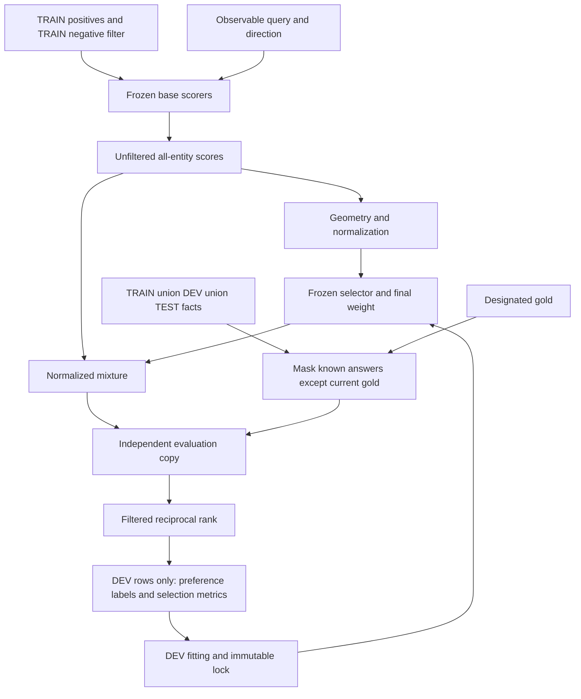

# B07 / C04：修复后重评复核

日期：2026-09-10。复核对象为 `information_boundary_v2`，不是原来的 filtered 特征结果。

**六个 MKG-W/DB15K 组合的重导出、DEV 重拟合/锁定和 TEST 重评，以及四个 DynaSemble selector 的重训练均已取得。主方法的 gold/filter 信息流修复得到代码路径单测和新导出的支持。旧稿“所有主组合、seed、方向均获益”不成立，已更新正文与表格。**

关闭口径：C04 的事实集合与训练/推理/评估边界已核实；B07 的已确认 mask 泄漏在六个组合的 ADC/Query-soft 路径上已修复并完成重评。若 B07 的关闭还要求所有连续 selector 输出在任意批次下逐位相等，目前不能作这一更强声明：部分连续输出有微小差异，原因尚未由现有导出单独确证。不能把这项保留意见写成“所有权重严格不变”。

## 1. 已核实的证据

- 每组覆盖三个配对 seed、head/tail 两个方向；每个原始三元组正好六条观测，没有重复观测。MKG-W DEV/TEST 分别 25,656/25,644 行，DB15K 分别 47,532/59,412 行；DEV 与 TEST 原始三元组交集为零。
- 六份 ADC lock 的 DEV 导出、selection、P3 summary、模型哈希全部吻合。四组 DynaSemble 的 DEV lock、参考导出、selection、三个 selector 哈希全部吻合。
- DynaSemble 锁记录的运行 commit 为 `84d60fa363ff6417188494eb26542c136a74155e`，工作树为 dirty，不能仅依赖 commit 断言运行代码。额外核对的两个评估脚本 SHA-256 与本地修复代码的 CRLF 版本完全一致，差异仅为换行格式。
- 各新导出与 ADC 应用文件的 query、基础 RR、Global RR 和 geometry 完整对齐；DynaSemble 的基础/Equal/Global RR 与同组共享导出相同。
- 可对应的十份旧 DEV/TEST 导出，其 standalone 两端逐查询 RR 与新导出完全一致。两个额外组合的旧 TEST 路径不存在，未把缺失对照当作通过。
- 所有六组 frozen `full` 消融均精确复现保存的 ADC RR；`beta=1`、`tau=0` 仅修改对应映射，未拟合或根据 TEST 重新选参。
- 新增审计测试覆盖：漏行不能通过 inner join、重复记录拒绝、NaN 拒绝、头/尾可观测 query 分组、小幅权重差异不能被容差掩盖、行顺序不影响对齐。结合原有边界和协议测试，共 43 项通过。

机器记录：[audit.json](G:/mmkg-project-research/outputs/paper_a_safe_correction/information_boundary_rerun_audit/audit.json)。`failures=[]` 仅表示列出的资产/离散权重检查通过；`status` 明确保留连续数值重复性限制，不是无条件投稿认证。

## 2. 同一可观测 query 的权重核对

分组键为 `(seed, direction, relation, observed_entity)`，排除 gold；仅检查包含至少两个不同 gold 的组。tail 的 observed entity 是 head，head 的 observed entity 是 tail。

六组 DEV 和 TEST 的 ADC 最终网格权重及 Query-soft 最终网格权重，**不一致组数均为零**。各 MKG-W 组合 DEV/TEST 分别检查 2,445/2,382 个多 gold 组；DB15K 分别为 4,179/5,472 组。

| 主组合 TEST | ADC 连续权重不一致组 | 最大连续权重跨度 | DynaSemble learned weight 不一致组 | 最大跨度 |
|---|---:|---:|---:|---:|
| MKG-W / M-Hyper + NativE | 6 | 2.254e-8 | 0 | 0 |
| MKG-W / M-Hyper + AdaMF-MAT | 8 | 4.206e-7 | 3 | 5.960e-8 |
| DB15K / M-Hyper + NativE | 0 | 0 | 0 | 0 |
| DB15K / M-Hyper + AdaMF-MAT | 0 | 0 | 3 | 1.192e-7 |

跨 DEV/TEST 的最大 ADC 连续跨度为 4.206e-7，DynaSemble learned weight 为 2.384e-7，部分 geometry 差异约为 float32 精度量级。这个量级与浮点/批次效应相容，但**相容不是因果证明**。实际 scorer/chunk/mask/export 路径的受控测试在只改变 gold/filter 时得到相同特征与权重；自然重复观测仍有上述差异。未对多 gold 记录做事后平均，也未用宽松容差把不一致归零。要关闭“任意批次连续输出逐位相等”的要求，需要原 GPU/完整 processed 数据下固定候选与批次的针对性重复实验；当前本地缺少这些 processed 输入。

## 3. 新 TEST 结果与论文必须撤回的表述

以下为 ADC 相对重新 DEV 选择的 Global 的绝对 MRR 增量。95% 区间使用 10,000 次原始三元组聚类 bootstrap，seed=20260910；同一三元组的六条观测作为整体抽样。区间条件于已有模型和 seed，不能解释为完整训练随机性区间。

| 数据集 / 组合 | ADC MRR | ΔMRR | 95% 区间 |
|---|---:|---:|---|
| MKG-W / M-Hyper + NativE | 0.367112 | +0.002447 | [+0.001481, +0.003425] |
| MKG-W / M-Hyper + AdaMF-MAT | 0.360735 | +0.001014 | [+0.000503, +0.001549] |
| DB15K / M-Hyper + NativE | 0.374485 | −0.000081 | [−0.000254, +0.000091] |
| DB15K / M-Hyper + AdaMF-MAT | 0.374778 | +0.000212 | [+0.000070, +0.000378] |
| MKG-W / NativE + AdaMF-MAT | 0.344266 | +0.000139 | [−0.000249, +0.000547] |
| DB15K / NativE + AdaMF-MAT | 0.312747 | −0.000015 | [−0.000163, +0.000129] |

必须改写的结论已落实到稿件：

1. 四主组合仅三组增量为正且区间下界为正；D-N 接近零、略负，不能称可靠增益。
2. 主组合 seed 正增量为 10/12，方向为 7/8。D-N 两个 seed 和 head 方向为负。分组 OOF DEV 的 D-N 增量也略负，D-A 的 seed/方向符号混合。`method_summary.csv` 的 DEV 行是 full-DEV resubstitution，正式 DEV 表使用 P3 held-out 记录，二者没有混用。
3. `beta=1` 提高四组 harm frequency，但 W-N、D-N 的 MRR 反而下降；D-A 的 conditional mean harm 下降。旧“放宽范围总能提高精度且提高伤害严重度”不成立。
4. D-A 去掉 fallback 的增量为 −0.002989，完整策略为 +0.000212，差约 +0.003201；W-A fallback 略牺牲 MRR。新锁的 W-N、D-N 阈值也不再为零。
5. 两个额外 NativE + AdaMF-MAT 组合的区间均跨零。不能延续旧稿额外 DB15K 组合显著获益的结论。
6. W-N 的 Relation 点估计高于 ADC；不能将新稿写成 ADC 全面优于静态策略。

新锁 `(alpha0, beta, tau)`：W-N `(0.55,0.45,0.10)`；W-A `(1,0.50,0.10)`；D-N `(1,0.20,0.20)`；D-A `(1,0.50,0.30)`；W-NA `(0.95,0.50,0.20)`；D-NA `(1,0.45,0.10)`。

## 4. C04：三个信息边界与伪代码



图中的 DEV 训练与锁定发生在 TEST 应用之前。TEST RR 不回传拟合；evaluation mask 不能回流到 `S/F/P`。

| 用途 | 正监督或事实集合 | gold 是否可见 |
|---|---|---|
| 基础模型正监督与负采样过滤 | TRAIN | TRAIN 目标可见 |
| ADC preference labels / DEV selection metrics | DEV 观测；其 filtered ranks 默认使用 TRAIN∪DEV∪TEST | 仅监督/评估可见 |
| DynaSemble selector 正监督与负采样过滤 | DEV 正监督；TRAIN∪DEV negative filter | DEV 训练目标可见，不读取 TEST 三元组做负采样过滤 |
| 在线特征、归一化、权重推断 | 可观测 query、方向、两模型完整未过滤候选分布 | 不可见 gold 或评估 filter |
| DEV/TEST filtered evaluation，包括 DEV checkpoint evaluation | 默认 TRAIN∪DEV∪TEST；另有显式 strict DEV 模式 TRAIN∪DEV | 当前 gold 保留，其他已知答案屏蔽 |

本次全部新共享导出的 `filter_fact_scope=train_dev_test`，不能写成使用了 strict DEV 选项。标准 filtered evaluation 使用 TEST 已知事实并不等于将 TEST 用作训练正监督；必须披露其评估作用，同时阻断进入推理特征。

```text
INFERENCE(q, direction, frozen_experts, frozen_policy):
    a, b = score_all_entities(q, direction)          # unfiltered
    geometry = feature_fn(a, b, direction)          # no gold / filter
    za, zb = normalize(a), normalize(b)             # no gold / filter
    alpha = frozen_policy(geometry)
    return mix(za, zb, alpha)                       # standalone ranks at endpoints

FILTERED_EVALUATION(scores, q, gold, fact_union):
    evaluation_scores = copy(scores)
    K = known_answers(q, fact_union)
    evaluation_scores[K minus {gold}] = -infinity
    reference = separately_scored_gold_with_same_unfiltered_normalization
    return 1 + count(evaluation_scores > reference) # strict-greater ties

DEV_TRAINING:
    make labels and selection metrics from DEV filtered ranks
    fit within grouped training folds; evaluate their held-out folds
    refit on full DEV, save model/config/source hashes; TEST applies lock
```

head prediction：M-Hyper 内部用 `(t,r_inverse,e)`，逆关系 ID 为 `r+|R|`；NativE/AdaMF-MAT 直接评分 `(e,r,t)`。head filter 始终以原关系的 `(r,t)` 查询已知 heads。规范预处理拒绝 split 内重复和跨 split 完全相同三元组；truth index 用 set，重复事实不重复遮蔽；绕过规范预处理的低层 reader/evaluator 保留观测重复，不能称其自动去重。

对应测试位于 [test_paper_a_information_boundary.py](G:/mmkg-project-research/tests/test_paper_a_information_boundary.py)，包括真实导出路径 gold/filter 干预、旧路径因果反例、gold 保留、dense/sparse mask、TRAIN∪DEV 负采样不读取 TEST、重复/重叠拒绝、过滤前归一化以及 DynaSemble 实际评估权重干预。

## 5. 交付与复现

- [更新后的论文](G:/mmkg-project-research/paper_a_draft/main.pdf)及 [LaTeX 正文](G:/mmkg-project-research/paper_a_draft/main.tex)：摘要、主结论、消融解释、参数与 DEV/TEST 表已更新；移除未重新核验的 OpenBG 数值、计时数字及旧 confidence/radius/coverage 图。
- [method_summary.csv](G:/mmkg-project-research/outputs/paper_a_safe_correction/information_boundary_rerun_audit/method_summary.csv)、[frozen_ablation.csv](G:/mmkg-project-research/outputs/paper_a_safe_correction/information_boundary_rerun_audit/frozen_ablation.csv)：重新计算的完整精度和区间。
- [审计脚本](G:/mmkg-project-research/scripts/audit_paper_a_boundary_rerun.py)、[出表脚本](G:/mmkg-project-research/scripts/build_paper_a_boundary_rerun_tables.py)和 [新增审计测试](G:/mmkg-project-research/tests/test_paper_a_boundary_rerun_audit.py)。
- 新稿使用 `tables/rerun/`，由 `rerun_source_manifest.json` 绑定来源。原稿、旧表、旧统计记录保留作历史材料，不能作为 v2 结果引用。
- `.gitignore` 增加本次大型逐查询 CSV、selector/model、checkpoint 及根目录旧论文 zip 的忽略规则；不会删除本地文件。原来已 tracked 的其他大型 dirty 文件不在本次操作范围，未修改或提交。

```powershell
& E:/develop/Miniconda3/python.exe scripts/audit_paper_a_boundary_rerun.py
# 已完成 bootstrap 后，仅重核资产与信息边界：
& E:/develop/Miniconda3/python.exe scripts/audit_paper_a_boundary_rerun.py --finalize-only
& E:/develop/Miniconda3/python.exe scripts/build_paper_a_boundary_rerun_tables.py
& E:/develop/Miniconda3/python.exe paper_a_draft/scripts/compile.py
& E:/develop/Miniconda3/python.exe paper_a_draft/scripts/verify_draft.py
```

后续如恢复 OpenBG 或计时结论，应针对修复后的路径补充对应运行；本次 44 条主重跑命令本来就不包含它们。当前稿选择排除这些未验证主张。连续输出逐位重复性保留意见如要求严格关闭，应作固定 gold 干预与批次干预的独立定位，不能靠改容差、对 gold 分组平均或 TEST 重调参处理。
